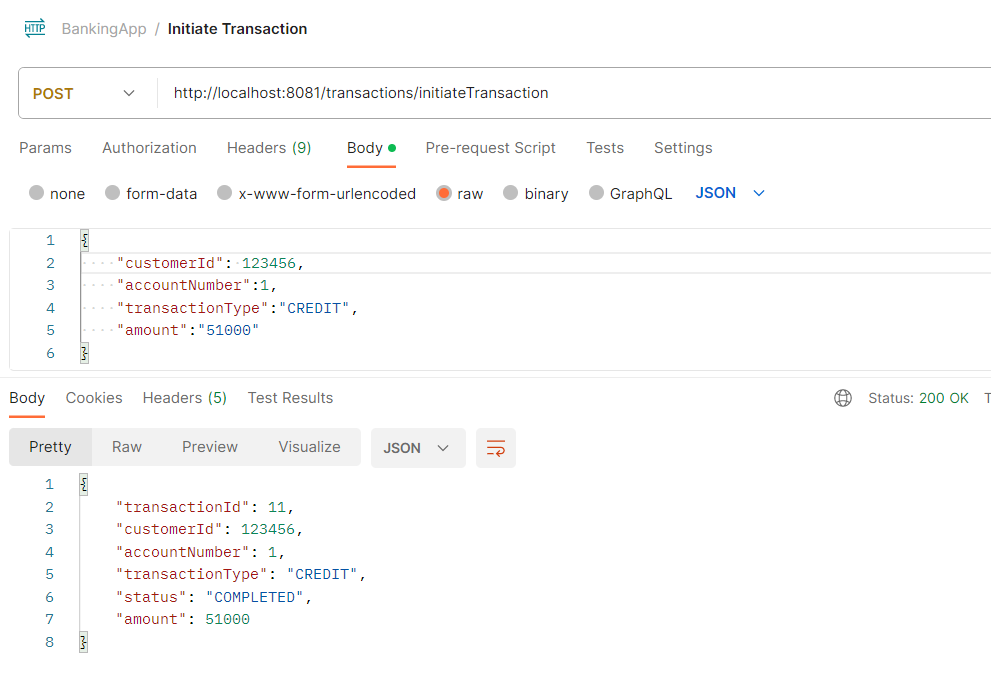
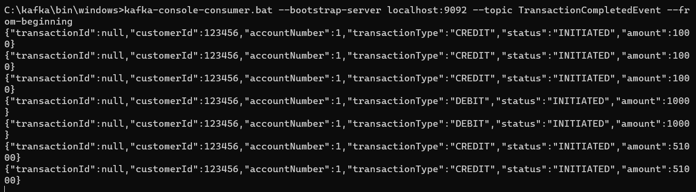
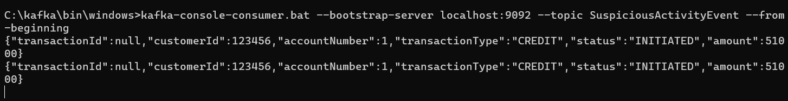

<h1 align="center"> Spring Microservice Design Patterns - Online Banking System </h1>
<h2 align="left">Languages and Tools:</h2>

   

 
<h2>Microservices</h2>

* <h3>Account Management Service</h3>
* <h3>Transaction Service</h3>
* <h3>Notification Service</h3>
* <h3>Audit Service</h3>
* <h3>Fraud Detection Service</h3>

 

<h2>Tasks 1 & 2:-</h2>

* Transaction services receives request to initiate transaction
* Transaction service calls account service to credit/debit account
* Transaction service process transaction and sends <b>TransactionCompleted</b> or <b>TransactionFailed</b> Event 
* Account Service listens to <b>TransactionFailed</b> event and reverts account balance
* Fraud Service listens to <b>TransactionCompleted</b> event and analyses transaction
* If transaction is Fraud, it sends <b>SuspiciousTransaction</b> Event
* Notification Service listens to <b>SuspiciousTransaction</b> Event and sends out email notification

<h2> Postman Script </h2>
Postman API test scripts can be found below.
[link](./postman-collection/BankingApp.postman_collection.json)

## Testing Screenshots:-

### 1. Create Account

### 2. Initiate Transaction:-

### 3. Kafka Transaction Completed Topic:-

### 4. Updated Account

### 5. Initiate another Transaction

### 6. Transaction Failed Topic

### 7.Account balance reverted:-

### 8.Initiate Suspicious Transaction with Amount > 50000

### 9.Fraud Service listens TransactionCompletedEvent and Analyses Transaction
 #### Transaction Completed Topic
 
 #### Suspicious Activity Topic
 

### 10.Notification Service Sends Email for Suspicious Activity

