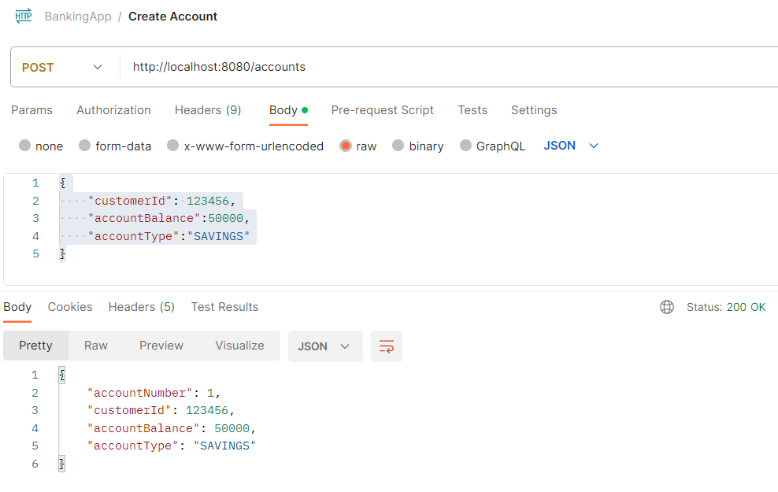
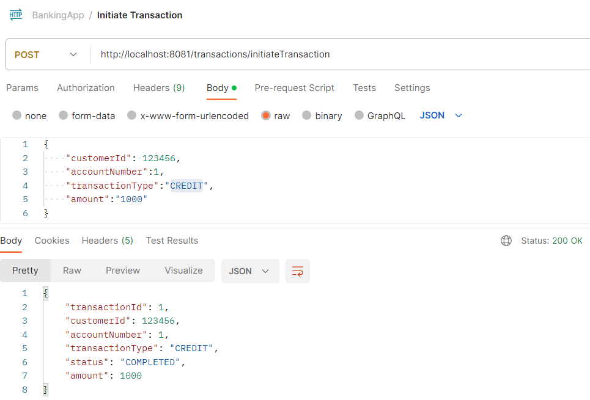
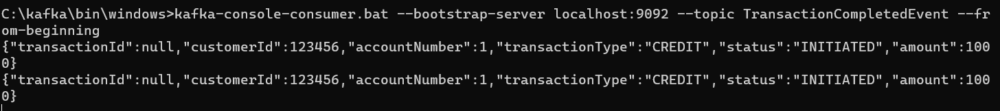
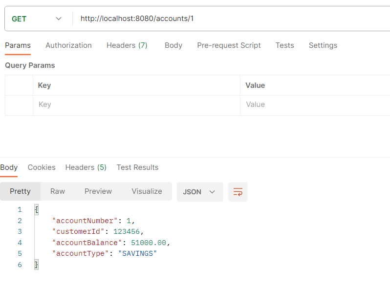
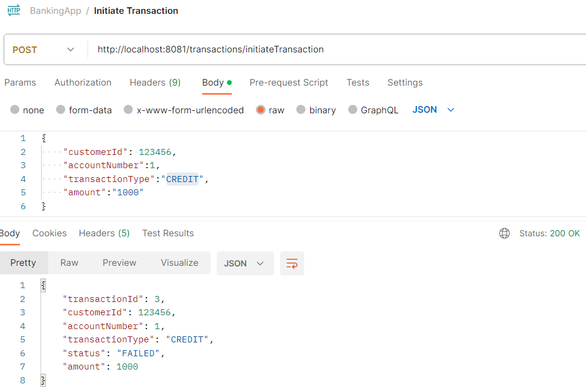
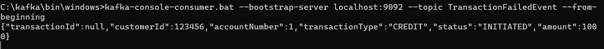
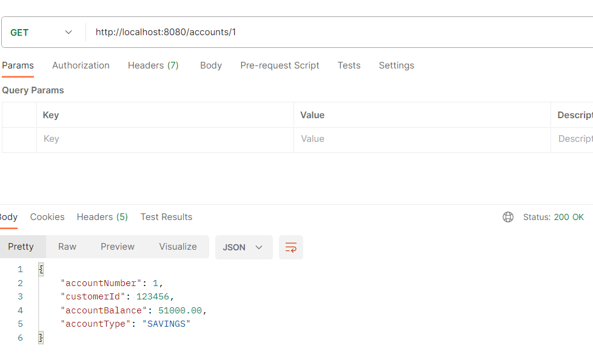

<h1 align="center"> Implementing Saga Pattern in Spring Boot:</h1>
<h2 align="left">Languages and Tools:</h2>

   

 
<h2>Microservices</h2>

* <h3>Order Service</h3>
* <h3>Product Service</h3>
* <h3>Payment Service</h3>
* <h3>Notification Service</h3>
 

<h2>Saga Flow:</h2>

* OrderService receives a request to place an order.
* It sends <b>OrderPlaced</b> event for InventoryService
* InventoryService checks Inventory and sends <b>StockReserved</b> Event To Payment Service
* PaymentService listens to <b>StockReserved</b> Event and process payment
* PaymentService sends <b>PaymentSuccessEvent</b> to Notification Service if Payment is successful
* PaymentService sends <b>PaymentFailedEvent</b> to Order Service and Notification Service
* Order Service would cancel the order when Event Fails
* Notification Service sends order succes/failed notifaction to customer

<h2> Postman Script </h2>
Postman API test scripts can be found below.
[link](./postman-collection/Saga-via-Kafka.postman_collection.json)

## Testing Screenshots:-

### 1. Create Product Inventory

### 2. Create Orders

### 3. Kafka "Order Placed" topic after 6 Orders processed by Order Service:-

### 4. Kafka "Inventory Reserved" After 6 Orders process by Inventory Service:-

### 5. Kafka "Payment Failed" and "Payment Success" Topic Events After 6 Orders are process by Payment Service:-

### 6. Order cancelled using fallback(Saga Pattern) if Payment is Failed Otherwise Order procesed successfully:-

### 7. Order Confirmation/Cancellation Notifications SMTP:-

