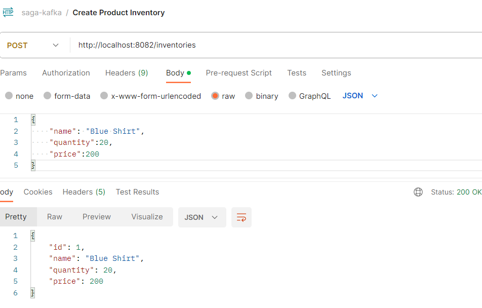
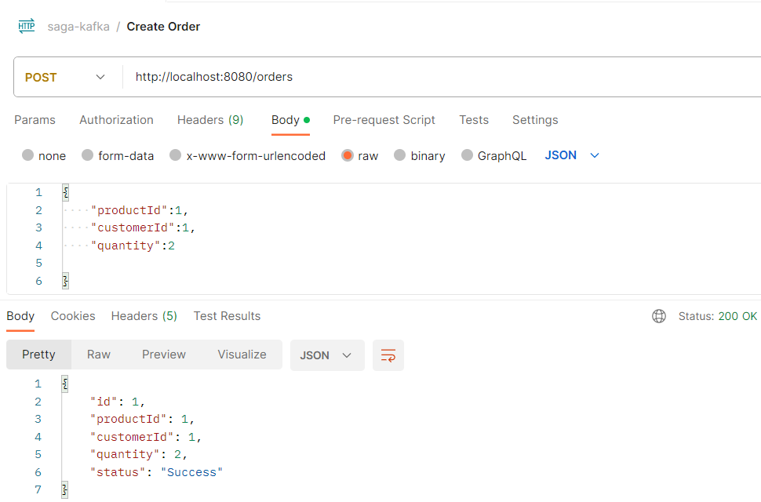
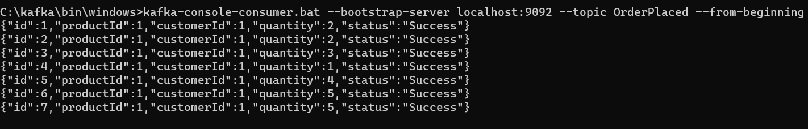
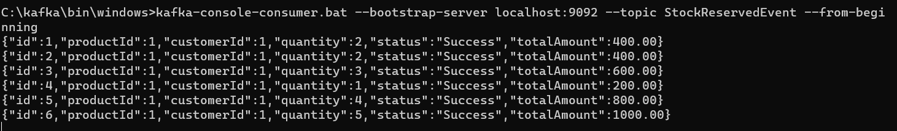
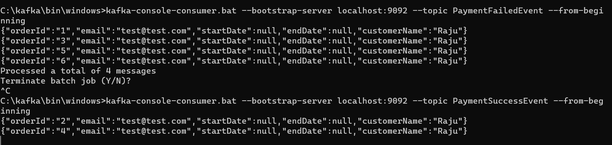
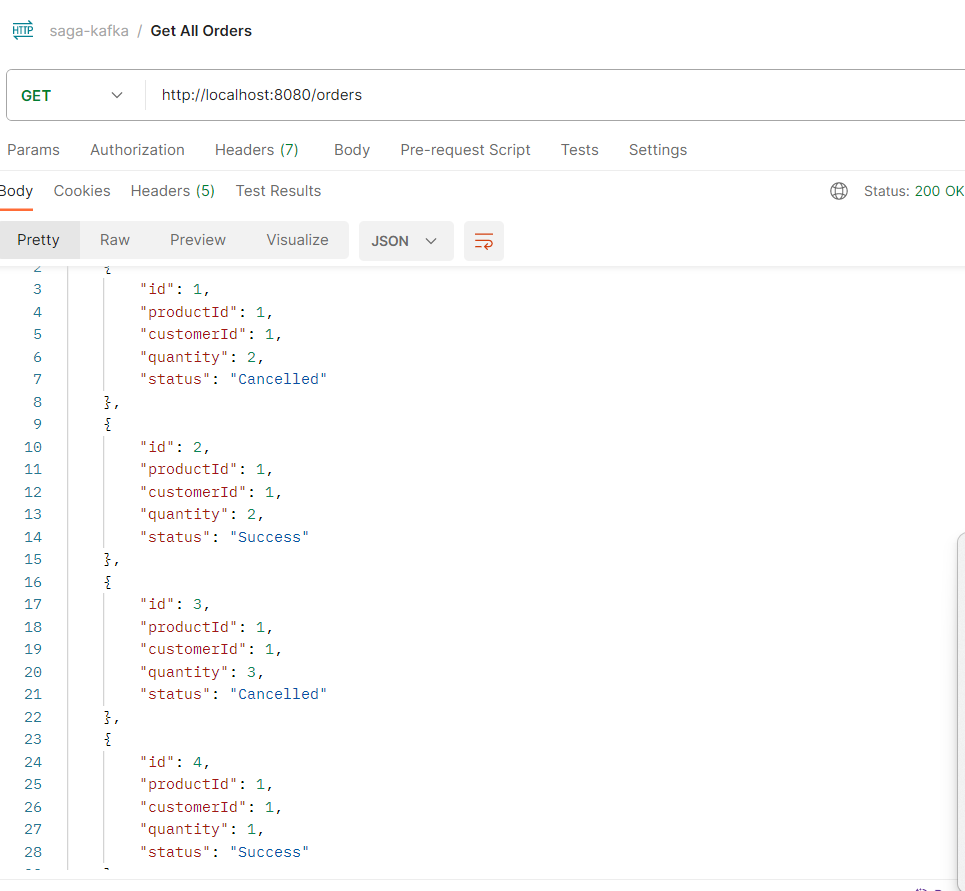
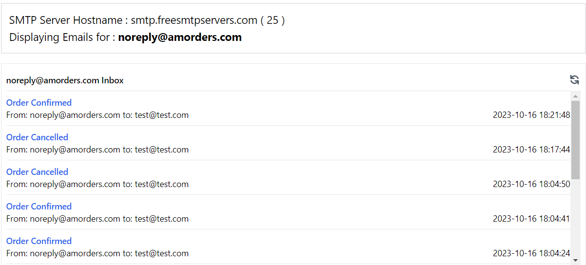

<h1 align="center"> Implementing Saga Pattern in Spring Boot:</h1>
<h3 align="left">Languages and Tools:</h3>

   

<h2>Saga Flow:</h2>

* OrderService receives a request to place an order.
* It sends OrderPlaced event for InventoryService
* InventoryService checks Inventory and sends StockReserved Event To Payment Service
* PaymentService listens to StockReserved Event and process payment
* PaymentService sends PaymentSuccessEvent to Notification Service if Payment is successful
* PaymentService sends PaymentFailed Event to Order Service and Notification Service
* Order Service would cancel the order when Event Fails
* Notification Service sends order succes/failed notifaction to customer

<h2> Postman Script </h2>
Postman API test scripts can be found below.
[link](./postman-collection/Saga-via-Kafka.postman_collection.json)

### Create Product Inventory

### Create Order

### Kafka "Order Placed" topic after 6 Orders processed by Order Service:-

### Kafka "Inventory Reserved" After 6 Orders process by Inventory Service:-

### Kafka "Payment Failed" and "Payment Success" Topic Events After 6 Orders are process by Payment Service:-

### Order cancelled using fallback(Saga Pattern) if Payment is Failed Otherwise Order procesed successfully:-

### Order Confirmation/Cancellation Notifications SMTP:-

